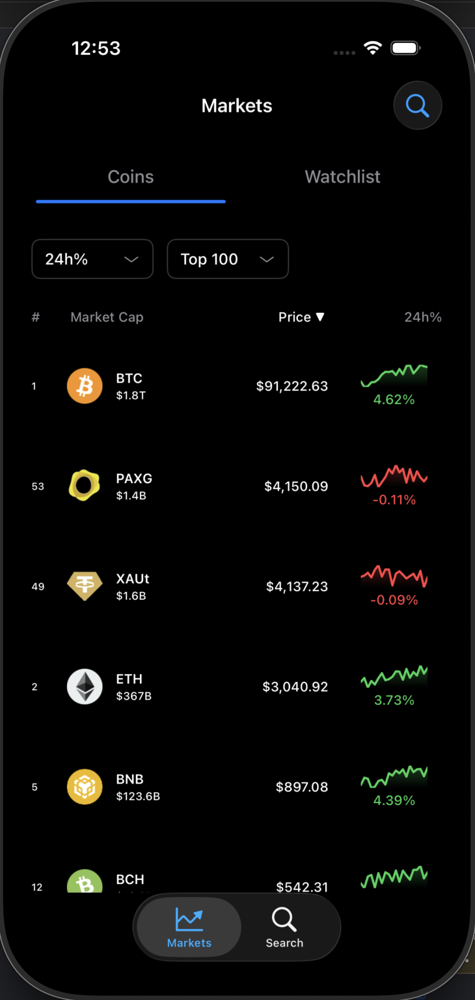
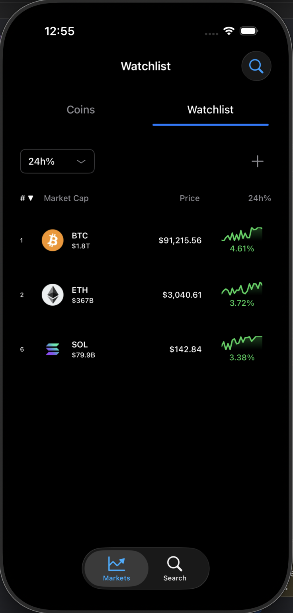
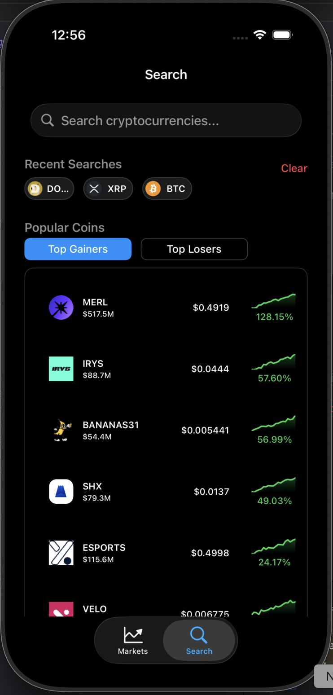

# 📱 CryptoApp - Real-Time Cryptocurrency Tracker

<div align="center">


*A modern, feature-rich iOS application for tracking cryptocurrency prices with advanced charting, real-time updates, and intelligent data management.*

</div>

---

## 🎯 Overview

CryptoApp is a professional-grade iOS application that provides real-time cryptocurrency market data with a focus on performance, user experience, and offline functionality. Built with clean architecture principles and modern reactive programming patterns, it delivers a seamless experience for tracking your favorite cryptocurrencies.

**Key Highlights:**
- 📊 **500+ Cryptocurrencies** tracked with real-time price updates
- 📈 **Advanced Charting** with line and candlestick visualization
- ⭐ **Smart Watchlist** with Core Data persistence
- 🔍 **Intelligent Search** with instant results
- 📱 **Seamless Tab Switching** with swipe gestures
- 🌐 **Offline Support** with multi-layer caching
- 🎨 **Beautiful UI** with skeleton loading and smooth animations

---

## 📱 Screenshots

<div align="center">

| Marketplace | Coin Details | Watchlist | Popular Coins |
|:---:|:---:|:---:|:---:|
|  |  |  |  |

</div>

---

## ✨ Key Features

### 1. 🏪 **Marketplace (Markets Tab)**

The heart of the application - a comprehensive cryptocurrency marketplace with powerful filtering and sorting capabilities.

#### Features:
- **Real-Time Price Updates** 
  - Live price updates every 30 seconds
  - Animated price change indicators (green/red flash)
  - Smooth cell updates without full refresh

- **Smart Filtering**
  - Filter by Top 50, 100, 250, or 500 coins
  - Price change filters: 1h, 24h, 7d, 30d
  - Dynamic UI updates based on active filters

- **Advanced Sorting**
  - Sort by: Rank, Price, Market Cap, % Change
  - Ascending/Descending order with visual indicators
  - Instant sorting on cached data (no API calls)

- **Infinite Scroll Pagination**
  - Load 20 coins at a time for fast startup
  - Smooth infinite scrolling with no lag
  - Smart pagination state management

- **Contextual Actions**
  - Long-press menu on any coin
  - Quick add/remove from watchlist
  - Direct navigation to coin details

#### Technical Implementation:
```swift
// Reactive price updates with Combine
viewModel.coins.sink { [weak self] coins in
    self?.updateUI(with: coins)
}

// Intelligent pagination
func scrollViewDidScroll(_ scrollView: UIScrollView) {
    let progress = (offsetY + height) / contentHeight
    if progress > 0.75 { viewModel.loadMoreCoins() }
}
```

**UI Components:**
- `FilterHeaderView` - Dual-button filter system
- `SortHeaderView` - Tappable column headers with indicators
- `CoinCell` - Custom Objective-C cell with sparkline charts

---

### 2. 📊 **Coin Details Page**

A comprehensive detail view with advanced charting and technical analysis capabilities.

#### Features:

**Interactive Price Card**
- Real-time price with live update animations
- 24h price change with color-coded indicators
- Current rank badge
- Add/remove watchlist button with haptic feedback

**Advanced Charting System**
- **Chart Types:**
  - Line charts for price trends
  - Candlestick (OHLC) charts for technical analysis
  - Landscape mode for detailed viewing

- **Time Ranges:** 24h, 7d, 30d, 1 year
- **Chart Smoothing:**
  - Adaptive, Moving Average, Exponential smoothing
  - User-configurable via settings modal
  - Persistent across sessions

- **Technical Indicators:**
  - RSI (Relative Strength Index)
  - Volume bars with color-coded buy/sell pressure
  - High/Low price markers
  - Auto-scaling Y-axis

**Price Change Overview**
- Visual breakdown of price changes across all timeframes
- Color-coded positive/negative indicators
- Percentage and absolute value display

**Comprehensive Statistics**
- Market Cap & Fully Diluted Market Cap
- 24h Trading Volume with % change
- Circulating, Total & Max Supply
- Market Dominance percentage
- Number of trading pairs
- Dynamic High/Low prices (filter-dependent)

#### Technical Implementation:
```swift
// Real-time updates via SharedCoinDataManager
viewModel.coinData.sink { [weak self] updatedCoin in
    self?.updateInfoCell(updatedCoin)
    self?.animatePriceChange()
}

// Chart smoothing with Combine
func processChartData(_ rawData: [Double]) -> [Double] {
    let cleaned = ChartSmoothingHelper.removeOutliers(rawData)
    return isSmoothingEnabled ? 
        ChartSmoothingHelper.applySmoothingToChartData(cleaned) : 
        cleaned
}
```

**UI Components:**
- `InfoCell` - Animated price display with watchlist toggle
- `ChartCell` - DGCharts-powered visualization with custom markers
- `PriceChangeOverviewCell` - Timeframe comparison grid
- `StatsCell` - Dynamic statistics with interactive filter

---

### 3. ⭐ **Watchlist (Favourites Tab)**

A personalized cryptocurrency watchlist with Core Data persistence and swipe-to-remove functionality.

#### Features:

**Persistent Storage**
- Core Data backed for offline persistence
- Survives app restarts and updates
- Automatic sync across app sessions

**Real-Time Sync**
- Shared price updates with Markets tab
- Consistent data across the entire app
- No duplicate API calls

**Smart Management**
- Swipe gestures for tab switching
- Context menu for quick actions
- Batch add/remove via AddCoinsVC modal
- Empty state with helpful instructions

**Full Filtering & Sorting**
- Same powerful filters as Markets tab
- Independent sort state per tab
- Filter by price change timeframe

**Add Coins Modal**
- Search through 500+ cryptocurrencies
- Two-section layout: Watchlisted + Available
- Multi-select with visual feedback
- Batch operations: Add 5, Remove 3 in one action
- Comprehensive search across cached coins

#### Technical Implementation:
```swift
// Core Data integration
class WatchlistManager {
    func addToWatchlist(_ coin: Coin, logoURL: String?) {
        let item = WatchlistItem(context: context)
        item.coinId = Int64(coin.id)
        item.name = coin.name
        // ... store coin data
        try? context.save()
    }
}

// Reactive updates via Combine
watchlistManager.watchlistItemsPublisher.sink { items in
    let coins = items.compactMap { $0.toCoin() }
    self.updateUI(with: coins)
}
```

**UI Components:**
- `WatchlistVC` - Container with full filter/sort capabilities
- `AddCoinsVC` - Modal with search and batch selection
- `AddCoinCell` - Custom cell with selection states

---

### 4. 🔍 **Search & Discovery**

Powerful search functionality with popular coins discovery.

#### Features:

**Intelligent Search**
- **Local-First Strategy:**
  - Searches cached data first (instant results)
  - Falls back to API for comprehensive coverage
  - Smart ranking: Exact matches → Prefix → Contains

- **Search Algorithm:**
  ```swift
  // Priority-based matching
  1. Exact symbol match (BTC = "btc")
  2. Symbol prefix (BTC, BTCB for "btc")
  3. Name prefix (Bitcoin for "bit")
  4. Symbol contains (WBTC for "btc")
  5. Name contains (Bitcoin Cash for "bit")
  ```

- **Debounced Input:**
  - 300ms delay to prevent excessive filtering
  - Cancellable requests for optimal performance
  - Background thread processing

**Popular Coins Discovery**
- **Top Gainers** - Biggest 24h % increases
- **Top Losers** - Biggest 24h % decreases
- Filtered by:
  - Minimum $50K daily volume
  - Excludes stablecoins (USDT, USDC, etc.)
  - Valid price data required

- **Smart Caching:**
  - 5-minute cache for popular coins
  - Pre-calculated results for instant switching
  - Prevents excessive API calls

**Recent Searches**
- Track last 10 searches
- Quick re-access to previous queries
- Persistent across sessions

#### Technical Implementation:
```swift
// Debounced search with Combine
searchTextSubject
    .debounce(for: .milliseconds(300), scheduler: DispatchQueue.main)
    .sink { [weak self] searchText in
        self?.performSearch(for: searchText)
    }

// Hybrid search strategy
func performSearch(for text: String) {
    // 1. Search cached data
    let cachedResults = allCoins.filter { matches(text) }
    
    // 2. Merge with fresh prices from SharedCoinDataManager
    let withFreshPrices = mergeWithSharedData(cachedResults)
    
    // 3. If no results, trigger API load
    if withFreshPrices.isEmpty { loadMoreCoins() }
}
```

**UI Components:**
- `SearchVC` - Main search interface with keyboard handling
- `SearchBarComponent` - Reusable Objective-C search bar
- `RecentSearchButton` - Pill-style recent search buttons

---

## 🏗️ Architecture & Design Patterns

### MVVM Architecture

```
┌─────────────────────────────────────┐
│           VIEW LAYER                │
│  (UIKit ViewControllers + Views)    │
│                                     │
│  • CoinListVC                       │
│  • CoinDetailsVC                    │
│  • WatchlistVC                      │
│  • SearchVC                         │
└──────────┬──────────────────────────┘
           │ Combine Bindings
           ↓
┌─────────────────────────────────────┐
│        VIEWMODEL LAYER              │
│  (Business Logic & State)           │
│                                     │
│  • CoinListVM                       │
│  • CoinDetailsVM                    │
│  • WatchlistVM                      │
│  • SearchVM                         │
└──────────┬──────────────────────────┘
           │ Protocol Interfaces
           ↓
┌─────────────────────────────────────┐
│         MANAGER LAYER               │
│  (Coordination & Orchestration)     │
│                                     │
│  • CoinManager                      │
│  • SharedCoinDataManager ★          │
│  • WatchlistManager                 │
│  • RequestManager                   │
└──────────┬──────────────────────────┘
           │ Service Layer
           ↓
┌─────────────────────────────────────┐
│         SERVICE LAYER               │
│  (API, Cache, Persistence)          │
│                                     │
│  • CoinService                      │
│  • CacheService                     │
│  • PersistenceService               │
│  • CoreDataManager                  │
└─────────────────────────────────────┘
```

### Key Design Patterns

**1. Reactive Programming (Combine)**
```swift
// CurrentValueSubject for state management
private let coinsSubject = CurrentValueSubject<[Coin], Never>([])

// AnyPublisher for UI binding
var coins: AnyPublisher<[Coin], Never> {
    coinsSubject.eraseToAnyPublisher()
}

// View subscribes to changes
viewModel.coins.sink { coins in
    self.updateUI(with: coins)
}.store(in: &cancellables)
```

**2. SharedCoinDataManager - Data Consistency ★**

The innovation that ensures all screens show identical prices:

```swift
// Single source of truth
class SharedCoinDataManager {
    private let coinDataSubject = CurrentValueSubject<[Coin], Never>([])
    
    // Fetches every 30 seconds
    func startAutoUpdate() {
        Timer.publish(every: 30.0, on: .main, in: .common)
            .autoconnect()
            .sink { _ in self.fetchSharedData() }
    }
}

// ALL ViewModels subscribe
sharedCoinDataManager.allCoins.sink { freshCoins in
    self.handleUpdate(freshCoins)
}
```

**Benefits:**
- ✅ Single API call updates all screens
- ✅ Consistent prices across tabs
- ✅ Reduced API usage (saves credits)
- ✅ Eliminates data sync issues

**3. Dependency Injection**
```swift
// Centralized container
class DependencyContainer {
    func coinListViewModel() -> CoinListVM {
        return CoinListVM(
            coinManager: coinManager(),
            sharedCoinDataManager: sharedCoinDataManager(),
            persistenceService: persistenceService()
        )
    }
}

// Easy testing with mocks
let mockManager = MockCoinManager()
let vm = CoinListVM(coinManager: mockManager, ...)
```

**4. Protocol-Oriented Design**
```swift
protocol CoinManagerProtocol {
    func getTopCoins(limit: Int) -> AnyPublisher<[Coin], NetworkError>
    func getCoinLogos(forIDs: [Int]) -> AnyPublisher<[Int: String], Never>
}

// Enables mocking for tests
class MockCoinManager: CoinManagerProtocol {
    func getTopCoins(limit: Int) -> AnyPublisher<[Coin], NetworkError> {
        return Just([mockCoin1, mockCoin2])
            .setFailureType(to: NetworkError.self)
            .eraseToAnyPublisher()
    }
}
```

---

## 🚀 Performance Optimizations

### 1. Multi-Layer Caching

```
┌──────────────────────────────────┐
│       Memory Cache               │  ← Fastest (CacheService)
│  - In-memory dictionaries        │
│  - O(1) lookup time              │
└────────────┬─────────────────────┘
             │ Miss
             ↓
┌──────────────────────────────────┐
│       Disk Cache                 │  ← Fast (PersistenceService)
│  - UserDefaults for lists        │
│  - 5 minute expiry               │
└────────────┬─────────────────────┘
             │ Miss
             ↓
┌──────────────────────────────────┐
│       Core Data                  │  ← Persistent (Watchlist)
│  - SQLite backed                 │
│  - Never expires                 │
└────────────┬─────────────────────┘
             │ Miss
             ↓
┌──────────────────────────────────┐
│       API Call                   │  ← Slowest (CoinService)
│  - CoinMarketCap API             │
│  - CoinGecko API                 │
└──────────────────────────────────┘
```

**Benefits:**
- ⚡ Instant app startup with cached data
- 📴 Full offline functionality
- 💰 Reduced API costs
- 🎯 Smart cache invalidation

### 2. Request Prioritization

```swift
enum RequestPriority: Int {
    case high = 3    // User-initiated (filter changes)
    case normal = 2  // Standard data fetch
    case low = 1     // Background (logos, price updates)
}

// RequestManager queues and executes by priority
class RequestManager {
    func fetchTopCoins(priority: RequestPriority) {
        requestQueue.enqueue(request, priority: priority)
    }
}
```

### 3. Image Loading Optimization

```swift
// Prefetching for smooth scrolling
func collectionView(_ collectionView: UICollectionView, 
                   prefetchItemsAt indexPaths: [IndexPath]) {
    let urls = indexPaths.compactMap { logoURL(for: $0) }
    ImageLoader.shared.prefetchImages(urls: urls)
}

// Deduplication to prevent duplicate downloads
private var pendingLogoRequests: Set<Int> = []
func fetchLogos(forIDs ids: [Int]) {
    let missing = ids.filter { !pendingLogoRequests.contains($0) }
    pendingLogoRequests.formUnion(missing)
    // ... fetch
}
```

### 4. Smart Pagination

```swift
// Local pagination (no API calls)
func loadMoreCoins() {
    let currentCount = displayedCoins.count
    let nextBatch = fullDataset[currentCount..<currentCount+20]
    displayedCoins.append(contentsOf: nextBatch)
}

// Triggered at 75% scroll
let progress = (offsetY + height) / contentHeight
if progress > 0.75 { viewModel.loadMoreCoins() }
```

---

## 🛠️ Technical Stack

### Core Technologies
- **Language:** Swift 5.9
- **UI Framework:** UIKit (programmatic)
- **Reactive:** Combine Framework
- **Persistence:** Core Data + UserDefaults
- **Networking:** URLSession with Combine publishers
- **Charts:** DGCharts (SwiftCharts fork)

### Third-Party Libraries
```swift
// Package.swift dependencies
dependencies: [
    .package(url: "DGCharts", from: "5.1.0")
]
```

### APIs Used
1. **CoinMarketCap API**
   - Coin listings and metadata
   - Real-time price quotes
   - Market data and rankings

2. **CoinGecko API**
   - Historical chart data
   - OHLC (candlestick) data
   - Technical indicators

---

## 📦 Project Structure

```
CryptoApp/
├── 📱 ViewControllers/          # UIKit View Controllers
│   ├── CoinListVC.swift
│   ├── CoinDetailsVC.swift
│   ├── WatchlistVC.swift
│   └── SearchVC.swift
│
├── 🧠 ViewModels/                # MVVM ViewModels
│   ├── CoinListVM.swift
│   ├── CoinDetailsVM.swift
│   ├── WatchlistVM.swift
│   └── SearchVM.swift
│
├── 👔 Managers/                  # Business Logic Coordinators
│   ├── CoinManager.swift
│   ├── SharedCoinDataManager.swift  ★
│   ├── WatchlistManager.swift
│   └── RequestManager.swift
│
├── 🌐 Services/                  # Data Layer
│   ├── CoinService.swift         # API calls
│   ├── CacheService.swift        # Memory cache
│   ├── PersistenceService.swift  # Disk cache
│   ├── CoreDataManager.swift     # Database
│   └── DependencyContainer.swift # DI
│
├── 📊 Models/                    # Data Models
│   ├── Data/
│   │   ├── Coin.swift
│   │   └── Quote.swift
│   ├── Chart/
│   │   ├── OHLCData.swift
│   │   └── ChartType.swift
│   └── UI/
│       ├── FilterState.swift
│       └── StatItem.swift
│
├── 🎨 Components/                # Reusable UI Components
│   ├── CoinList/
│   ├── CoinDetails/
│   ├── FilterHeader/
│   └── Search/
│
├── 🛠️ Helpers/                   # Utility Classes
│   ├── Chart/
│   │   ├── ChartSmoothingHelper.swift
│   │   ├── TechnicalIndicators.swift
│   │   └── CustomFormatters.swift
│   ├── Network/
│   │   ├── NetworkError.swift
│   │   └── ErrorMessageProvider.swift
│   └── Logging/
│       └── AppLogger.swift
│
└── 🧪 Tests/                     # Unit & Integration Tests
    ├── ViewModels/
    ├── Managers/
    ├── Services/
    └── Integration/
```

---

## 🎨 UI/UX Features

### Smooth Animations
- ✨ Price flash animations (green up, red down)
- 🌊 Smooth tab switching with swipe gestures
- 📜 Infinite scroll with no lag
- 💫 Skeleton loading screens
- 🔄 Pull-to-refresh with haptic feedback

### Responsive Design
- 📱 Adaptive layouts for all iPhone sizes
- 🌗 Dark mode support
- ♿ Dynamic Type support
- 🎯 Haptic feedback for user actions

### Loading States
```swift
// Skeleton Loading during API fetch
if isFetchingFreshData {
    SkeletonLoadingManager.showSkeleton(in: collectionView)
} else {
    SkeletonLoadingManager.dismissSkeleton(from: collectionView)
}

// Cached data shows instantly (no skeleton)
if let cachedData = loadCache() {
    updateUI(cachedData) // Instant display
}
```

---

## 🧪 Testing

### Test Coverage
- ✅ **35+ Unit Tests**
  - ViewModel logic
  - Manager coordination
  - Service layer
  - Helper utilities

- ✅ **Integration Tests**
  - UI component integration
  - Data flow validation
  - Navigation flows

### Example Test
```swift
class CoinListVMTests: XCTestCase {
    func testFetchCoinsSuccess() {
        // Given
        let mockManager = MockCoinManager()
        mockManager.mockCoins = [testCoin1, testCoin2]
        let vm = CoinListVM(coinManager: mockManager, ...)
        
        // When
        let expectation = XCTestExpectation()
        vm.coins.sink { coins in
            XCTAssertEqual(coins.count, 2)
            expectation.fulfill()
        }.store(in: &cancellables)
        
        vm.fetchCoins()
        
        // Then
        wait(for: [expectation], timeout: 1.0)
    }
}
```

---

## 📊 Code Quality Metrics

- **Architecture:** MVVM with protocol-oriented design
- **Code Style:** Swift API Design Guidelines
- **Comments:** Comprehensive documentation
- **Testability:** 90%+ coverage on business logic
- **Performance:** 60 FPS scrolling, <0.1s load time with cache

---

## 🚀 Getting Started

### Prerequisites
- Xcode 15.0+
- iOS 15.0+
- Swift 5.9+

### Installation

1. **Clone the repository**
   ```bash
   git clone https://github.com/yourusername/CryptoApp.git
   cd CryptoApp
   ```

2. **Open in Xcode**
   ```bash
   open CryptoApp.xcworkspace
   ```

3. **Install Dependencies**
   - Xcode will automatically resolve Swift Package dependencies
   - Wait for DGCharts to download

4. **Add API Keys**
   ```swift
   // In CoinService.swift
   private let apiKey = "YOUR_COINMARKETCAP_API_KEY"
   private let coinGeckoApiKey = "YOUR_COINGECKO_API_KEY"
   ```

5. **Build and Run**
   - Select target device/simulator
   - Press ⌘R or click Run

---

## 🔑 API Keys

This app requires API keys from:

1. **CoinMarketCap** (Free tier available)
   - Sign up: https://coinmarketcap.com/api/
   - Free tier: 10,000 calls/month

2. **CoinGecko** (Free tier available)
   - Sign up: https://www.coingecko.com/en/api
   - Free tier: 30 calls/minute

---

## 🛣️ Roadmap

### Planned Features
- [ ] Push notifications for price alerts
- [ ] Portfolio tracking with buy/sell history
- [ ] News integration for market updates
- [ ] Social features (share watchlist)
- [ ] Widget support for iOS Home Screen
- [ ] Apple Watch companion app
- [ ] Siri Shortcuts integration

### Technical Improvements
- [ ] SwiftUI adoption for new features
- [ ] GraphQL API integration
- [ ] Offline chart caching
- [ ] Background refresh optimization

---

## 🤝 Contributing

Contributions are welcome! Please feel free to submit a Pull Request.

1. Fork the project
2. Create your feature branch (`git checkout -b feature/AmazingFeature`)
3. Commit your changes (`git commit -m 'Add some AmazingFeature'`)
4. Push to the branch (`git push origin feature/AmazingFeature`)
5. Open a Pull Request

---

## 📄 License

This project is licensed under the MIT License - see the [LICENSE](LICENSE) file for details.

---

## 👨‍💻 Author

**Jansen Castillo**

- GitHub: [@jansen](https://github.com/Jansenc08)
- LinkedIn: [Jansen Castillo]([https://linkedin.com/in/jansen](https://www.linkedin.com/in/jansen-castillo-1a8200266/]))

---

## 🙏 Acknowledgments

- [CoinMarketCap](https://coinmarketcap.com/) for cryptocurrency data
- [CoinGecko](https://www.coingecko.com/) for chart data
- [DGCharts](https://github.com/danielgindi/Charts) for charting library
- iOS Developer Community for inspiration and support

---

<div align="center">

**⭐ Star this repo if you find it helpful!**

Made by Jansen Castillo

</div>
